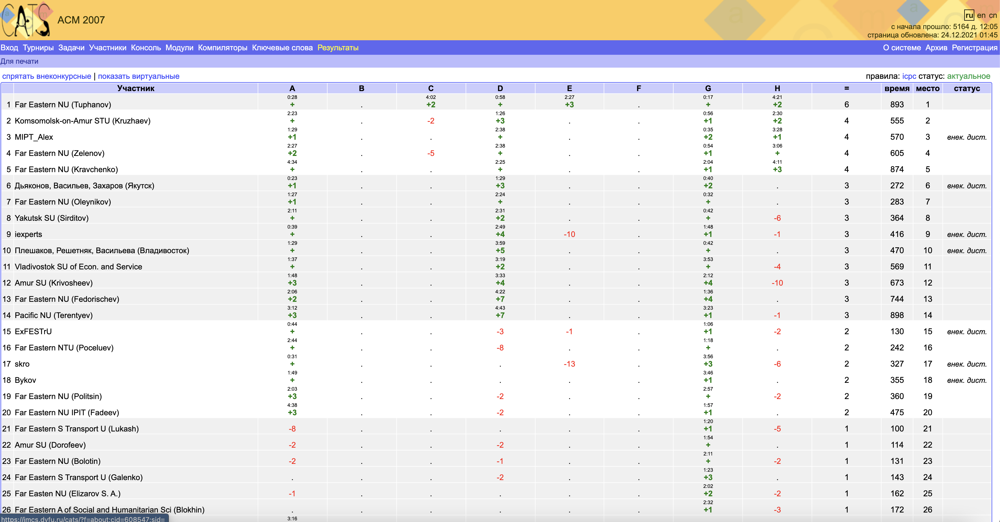
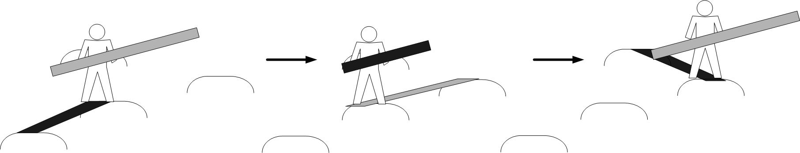

# Frogless swamp

## Problem statement

Alice has to cross the swamp. The swamp is a strip of width  `swamp_width` stretching indefinitely both to the east and to the west. Alice stands at the southern border of the swamp, having `Y` coordinate `0`, and wants to get to the northern border, which `Y` coordinate is `swamp_width`. Alice has found a plank of length `plank_length` and a map showing all `hummocks`, points with `X` and `Y` coordinates, capable of holding her weight. Hummocks are too slippery to stand on, so Alice decided to break a plank in two parts (of smaller length) and use them to move in the following way: she would stand on first part, throw the second part over to the nearby hummock, step onto the second part, pick up the first part, and walk with it across the second one or throw the first part again to nearby hummock. Important condition is that Alice must always stand on the plank. She can, however, put both parts of the plank between the same two hummocks and/or use the parts in any order she wants. Repeating this procedure as necessary, Alice hopes to reach the other side of the swamp as fast as possible.

Find the shortest distance Alice has to walk to cross the swamp or determine that she can not do so. Distance is measured from hummock to hummock, even if plank part is longer than the distance between hummocks.

## Show Score (2006)

[ShowScore2006](https://imcs.dvfu.ru/cats/?f=rank_table;cache=1;cid=565452;hide_virtual=1;sid=)

## Show Score (with Frogless swamp 2007)

[ShowScore2007](https://imcs.dvfu.ru/cats/?f=rank_table;cache=1;cid=608547;hide_virtual=1;sid=)

### P.S.

A more sophisticated description of the problem can be found at the [link](https://imcs.dvfu.ru/cats/static/problem_text-cpid-611741.html)

## Input file format

Input contains integers 
- `swamp_width`
- `plank_length`
- `hummocks_num`

Followed by `hummocks_num` pairs of integers (`x`, `y`) — hummock coordinates.
The swamp edge Alice stands on coincides with `y = 0` line, and the opposite edge — with `y = Y` line.

## Output file format

Output must contain a single floating point number — the shortest distance Alice has to travel with at least 3 correct decimal digits.
If there is no solution, output must contain the number `−1`.

## Constraints
- 1 ≤ N ≤ 100
- 1 ≤ Y, M ≤ 1000
- 0 ≤ x, y ≤ 1000

## Example

## Sample tests

| No. | Input file | Output file |
| --- | ---------- | ----------- |
| 1   | 13 7 6     | 20.595      |
|     | 13 3       |             |
|     | 13 5       |             |
|     | 9 7        |             |
|     | 7 7        |             |
|     | 3 8        |             |
|     | 2 9        |             |
| 2   | 20 16 1    | -1          |
|     | 100 10     |             |